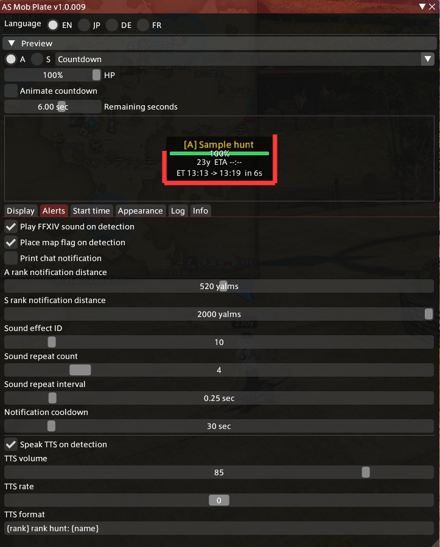
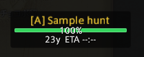
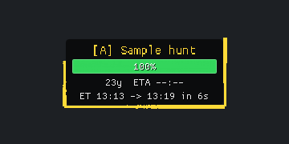
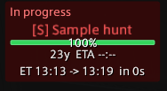
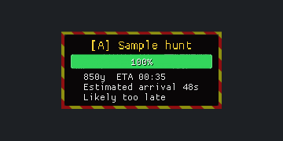

# AS Mob Plate

A lightweight, standalone Dalamud plugin for FFXIV A-rank and S-rank hunts. Display overhead HP plates, receive detection alerts, and track announced Eorzea Time starts without targeting a hunt.

## Install via Dalamud

Add this [custom repository JSON URL](https://raw.githubusercontent.com/MintakaSeiran/AsMobPlate/main/pluginmaster.json) to Dalamud's **Custom Plugin Repositories**:

```text
https://raw.githubusercontent.com/MintakaSeiran/AsMobPlate/main/pluginmaster.json
```

Save and enable the repository, then open the plugin installer, search for **AS Mob Plate**, and install it. Future approved releases will be available through Dalamud's plugin update system. Adding the URL does not install the plugin until you select Install.

Developer testers can keep using the dev-plugin installation below. Avoid enabling both installations at the same time.

## Download

**[Download the compiled plugin ZIP (1.0.25.0)](https://github.com/MintakaSeiran/AsMobPlate/releases/download/v1.0.25.0/AsMobPlate-1.0.25.0.zip)** | [Release notes and SHA256 checksum](https://github.com/MintakaSeiran/AsMobPlate/releases/tag/v1.0.25.0)

**Stable release: approved for publication by the maintainer.** Download the plugin ZIP above, not GitHub's automatically generated source-code archives. The ZIP includes the DLL, generated manifest, dependencies and images.

For developer installation, disable the currently loaded AS Mob Plate plugin, extract the entire ZIP into `%APPDATA%\XIVLauncher\devPlugins\AsMobPlate`, then select `AsMobPlate.dll` in Dalamud's developer plugin locations if it is not already registered. Reload the plugin and verify `1.0.025` in its settings title. Replacing files alone does not reload an already running plugin. This download is a manual dev-plugin installation, not an automatic updater repository.

[](docs/images/settings-en.png)

*English settings and live preview in version 1.0.016. User-provided UI capture; the displayed settings are customized examples, not defaults. The nameplate uses sample data.*

**Current release:** `1.0.025` | **Development build:** `1.0.025` | **Author:** [MintakaSeiran](https://github.com/MintakaSeiran)

### SS Trigger Highlight (1.0.025)

Only when a confirmed SS scouting system message is received, the most recently defeated S-rank plate still within its display lifetime gains four cyan corner brackets and a fixed **Defeated / SS roll pending** label (JP: the localized equivalent). Without the minion trigger, the label remains **Defeated**. The label describes the triggered SS follow-up, not a directly observed server-side roll. The top-left/bottom-right pair and the top-right/bottom-left pair brighten alternately. The background becomes steady near-black, and the brackets replace the warning stripes. Default appearance is cyan `#00E5FF`, 4 px thick, with a one-second full cycle that retains 35% of the configured opacity at its dimmest. A black outline keeps the brackets visible against bright scenery. Each arm spans 28% of its plate edge, leaving the middle of each edge open.

Appearance settings include a frame enable switch, color, thickness (1-10 px), and pulse period (0.5-3 seconds). Turning the frame off preserves the triggered status label. Preview includes **SS minions spawned** with sample S-rank data; it does not play sounds or change live tracking. All labels support EN/JP/DE/FR.

The highlight lasts only for the existing defeated-plate lifetime (30 seconds by default, measured from observed death). SS stage changes and duplicate announcements do not restart that lifetime or remove the highlight. A system message arriving before the death sample waits up to three seconds for a matching observation. Normal chat reports, disappearance, and minion sightings alone do not mark an S-rank plate. Without a matching defeated S observation, the existing progress panel and five-sound notification remain available. Territory/world/instance changes and logout clear the association; normal visibility and distance settings still apply.

### Party Finder Helper (1.0.024)

Right-click anywhere inside a live A/S/SS hunt nameplate to open the game's **Party Recruit Editor** directly. The helper prepares a normal eight-player, world-only Hunt recruitment: public listing, all four participation languages, no item-level requirement or job-duplication restriction, and tank/healer jobs for empty slots. Existing party members retain their occupied slots. The final **Recruit Members** button is pressed by the user.

Version 1.0.024 removes the context menu and plugin confirmation popup. Setup waits for the native finder and editor to initialize before filling the controls. It stops after filling the editor; subsequent manual edits are not overwritten. Existing recruitment drafts and active listings are preserved. Failures time out after ten seconds and produce a localized chat message; setup stages are included in the plugin's exportable debug log.

The public comment follows the selected AS Mob Plate UI language and contains the hunt rank/name, area and map coordinates, without role text. If an announced ET start is active in the current territory, it is appended. Long names are shortened within the native UTF-8 buffer limit while preserving the start ET. Review the prepared settings in the native editor before registering the recruitment.

### Combat Start and Elapsed Time (1.0.022)

Living hunts with HP at or below 99.99% display **In progress**, independently of announced ET. An elapsed announcement no longer displays `in 0s` or establishes combat on its own. Actual combat hides the announced-start line even if its target ET is in the future.

If full HP was observed continuously before the first sample at or below 99.99%, the label includes elapsed time from that sample, for example `In progress 01:15`. First detection at reduced HP, or a gap over one second before the threshold crossing, omits the timer. The timer never substitutes the announced ET for the actual pull time. A full-HP, out-of-combat reset clears the timer; territory/world/instance changes and logout clear observations. The existing in-progress label setting applies in all four UI languages.

## Nameplate Examples

| Idle | Countdown |
| --- | --- |
|  |  |
| HP and distance without an announced start. | Announced ET start and remaining real seconds. |

| In Progress | Arrival Warning |
| --- | --- |
|  |  |
| In-progress label and background. | Estimated arrival exceeds the remaining kill time. |

*User-provided English S-rank preview captures with sample data and customized appearance settings. The arrival warning's red/black background animation is shown as a still image.*

## SS Events and Defeated Hunts

Version 1.0.018 adds independent Display switches for SS minions, SS bosses, a non-interactive progress panel, and defeated plates. All default to enabled. Defeated plates remain for 30 seconds by default (configurable from 1 to 300 seconds). Panel X/Y settings place the overlay relative to the main viewport; it never captures mouse or keyboard input.

### Verified Identities

| Expansion | SS boss / BNpcName ID | Minion / BNpcName ID | Territory IDs |
| --- | --- | --- | --- |
| Shadowbringers | Forgiven Rebellion / 8915 (`0x22D3`) | Forgiven Gossip / 8916 (`0x22D4`) | 813-818 |
| Endwalker | Ker / 10615 (`0x2977`) | Ker Shroud / 10616 (`0x2978`) | 956-961 |
| Dawntrail | Arch Aethereater / 13406 (`0x345E`) | Crystal Incarnation / 13407 (`0x345F`) | 1187-1192 |

All six IDs were verified against ACT `261` object-add records from September 24-26, 2026. Territory IDs were cross-checked against the [TerritoryType game-data extract](https://github.com/xivapi/ffxiv-datamining/blob/master/csv/en/TerritoryType.csv). Detection uses `IBattleNpc.NameId`, never display names, HP magnitude, levels, rank fields or icons. SS plates and minion plates use the S notification distance and text color. The registry has no runtime dependency on another plugin.

### Progress Rules

From version 1.0.020, a confirmed scouting-start system message queues **five notification sounds**, using the existing sound effect ID and repeat interval. The notification sound switch also controls this alert; disabling it cancels pending sounds. The trigger count is fixed at five, independently of the ordinary detection repeat count. Duplicate start messages within five seconds do not retrigger it. Ordinary object detections cannot interrupt this sequence. Sounds advance on framework updates even when the overlay is hidden; object detection alone, END reports, return messages and a missed start announcement do not generate this trigger alert.

- Recognize all four official JP/EN/DE/FR texts for `LogMessage` rows 9332 (minions begin scouting) and 9334 (minions return), independently of the game and settings UI language, as of version 1.0.021. Also read the current game's localized rows using Dalamud's data manager. Require system LogKind 57 and a full-text match after trimming boundary whitespace and normalizing the German non-breaking space. Player quotations and ordinary hunt-presence messages do not trigger this alert. ACT's raw `0839` includes extra flags and is not used as a Dalamud enum value. Texts were checked against the [game-data extracts](https://github.com/xivapi/ffxiv-datamining/tree/master/csv) for ja/en/de/fr.
- In an eligible territory, the scouting message starts the event without requiring the player's S-rank reward. A known minion or boss can also establish an observed stage when the start message was missed.
- Display searching, observed minion combat, boss detected, boss defeated, or minions returned. Boss confirmation requires its matching NameId for this territory group. Four observed minion deaths alone never imply that the boss has been detected.
- Count unique observed dead minion object IDs, labeled **Observed defeats**, not **Remaining**. Remote deaths are not guaranteed to appear in the local object table. Zero HP or the object's dead state confirms death; disappearance and reward messages alone do not.
- For Shadowbringers/Endwalker only, show a five-minute **engagement guideline** when the actual start message was received. At zero, display **Awaiting outcome confirmation**, never automatic failure. The [Shadowbringers](https://jp.finalfantasyxiv.com/lodestone/character/35119336/blog/4956886/) and [Endwalker](https://jp.finalfantasyxiv.com/lodestone/character/35119336/blog/4956894/) player reports describe time to engage, not time to complete all kills. Dawntrail has no assumed timer.
- Say/Shout/Yell completion reports ending in `END`, or containing the supported Japanese completion phrases, show an unconfirmed informational notice for 30 seconds during an active event. They never mark an individual dead, increment kills or confirm an SS spawn.
- Clear tracking on loading, logout, territory, current-world or public-instance changes. An abandoned event expires after 30 minutes without observations, without reporting a failure. Terminal panel states use the defeated display duration.
- Reset the old ET schedule on context changes and an SS scouting announcement so the previous S start is not reused. Minion plates do not display an announced ET start.

### Defeated Plates

Confirmed dead A/S hunts, SS minions and bosses retain copied name, object index, last observed position and death time. Their plate shows zero HP, distance to that position, a defeated label and elapsed seconds, using the warning frame and red/black pulse. It obeys the relevant rank switch and maximum display distance. No position or identity is invented for an unobserved hunt. Expiry is measured from the first observed death and is not extended while a corpse remains loaded.

Tracking runs on framework updates independently of drawing. Observations are capped at 256, temporary removal buffers are reused, and names are copied once per observed identity. Chat and framework events are unsubscribed on disposal. No new targeting, mount, AI or other-plugin control is introduced.

### Verification

Automated tests cover known IDs, regular-B exclusion, disappearances, the five-minute boundary, duplicate deaths, duplicate announcements, stage precedence, return, context reset and unsupported territories. Native ImGui tests cover minion/SS/dead plates across four UI languages and multiple scales. In-game acceptance still requires checking localized system messages, instance transitions, distant unobserved kills and the final GPU-rendered panel. Unknown spawn probabilities, a separate SSS tier and unverified boss-reset behavior are not encoded.

## Arrival Warning

For A/S hunts in combat at least 200 yalms away, the overlay estimates arrival from two-second samples of the player's movement projected toward the hunt. Arrival time is `(distance - arrival distance) / closing speed + preparation time`. Defaults are 25 yalms and 3 seconds. These are configurable estimates, not action-range checks or pathfinding.

When estimated arrival exceeds the HP-based remaining kill time, a 4-pixel (scaled) outer frame shows alternating red/yellow diagonal stripes, both at 50% opacity by default. The interior background smoothly pulses between near-black and dark red over a two-second cycle at 88% opacity to preserve text readability. Stripes never cover the content area. The warning overrides the normal and in-progress backgrounds, but preserves text, HP bars and countdown frames. Display settings can disable the warning; Appearance settings edit both frame stripe colors and alpha. Select "Likely too late" in Preview to inspect it.

From version 1.0.019, once a live plate shows **Likely too late**, its warning label, striped frame and pulsing background remain latched for that individual hunt. Stopping, approaching within 200 yalms, improved estimates, missing samples and temporary disappearance do not clear the warning. Distance and available estimates still update; unavailable estimates are not frozen or invented. Confirmed death replaces the warning with the defeated state. Loading, logout, territory/world/instance changes or plugin reload clear retained identities. The warning setting can hide the display without erasing its latch. Before the first warning, insufficient samples or missing kill estimates still prevent a prediction. Terrain, detours, changing speed and damage rate can make predictions inaccurate. This feature only reads game state and draws an overlay; it does not change targets, mounts or other plugins.

## Slash Commands

`/asmobplate`, `/amp`, `/asmob`, and `/asm` share all commands and toggle settings without arguments. Changes are saved immediately.

| Arguments | Action |
| --- | --- |
| `config` or `open` / `close` | Open / close settings |
| `preview` | Open settings and expand the preview |
| `help` / `status` | Print command help / current settings |
| `a`, `s` + `on`, `off`, or `toggle` | Enable or disable each hunt rank, including its detection alerts |
| `sound`, `tts`, `hp`, `percent`, `flag`, `countdown` + `on`, `off`, or `toggle` | Change the corresponding setting |
| `distance <1-2000>` | Set maximum plate display distance in yalms; notification distances are unchanged |
| `lang <en|jp|de|fr>` | Select the settings language |
| `log dump` / `log clear` | Save the debug log to the path printed in chat / clear the in-memory log |

Examples: `/amp a off`, `/amp sound toggle`, `/amp distance 2000`, `/amp lang jp`.
Commands and arguments are case-insensitive. Invalid arguments show help without changing settings. If another plugin owns an alias, AS Mob Plate leaves that command registered to its owner and records a warning.

## Features

- NameId-based A/S and SS nameplates, with a specific allowlist for SS minions. Normal B ranks remain excluded.
- Distance and estimated time to kill based on observed HP loss.
- Announced ET start times, remaining real seconds, and an in-progress state with a separate background color.
- A shrinking countdown outline with independently adjustable thickness.
- Configurable FFXIV sound repeats, Windows TTS, chat notices, and map flags on detection.
- Tabbed settings with EN, JP, DE, and FR translations and a live in-window preview.
- Standalone operation: no runtime dependency on HuntHelper.

## Companion Plugin: HuntAlerts

[HuntAlerts](https://puni.sh/directory/asuna/huntalerts) notifies you when hunt trains are starting soon. Using it alongside AS Mob Plate can make hunting more convenient: HuntAlerts helps you find upcoming trains, while AS Mob Plate shows local A/S hunt HP, distance, announced ET starts, and arrival estimates once a hunt is available in the game's object table.

- [HuntAlerts source repository](https://projects.gamba.pro/Asuna/huntalerts)
- [Asuna's plugin repository and installation information](https://puni.sh/directory/asuna)
- Custom Dalamud repository URL: `https://puni.sh/api/repository/asuna`

The plugins operate independently. AS Mob Plate does not require HuntAlerts, control its settings, or import its notification feed. ET countdowns still depend on supported chat announcements received by AS Mob Plate. If notifications overlap, adjust sound and TTS settings in each plugin to your preference.

## Settings and Preview

Open settings with:

```text
/asmobplate
```

The window has **Display**, **Alerts**, **Start time**, **Appearance**, **Log**, and **Info** tabs. The language selector stays above the tabs, and changes are saved immediately. The initial UI language is JP; select EN for English. Existing settings are preserved.

The collapsible preview uses the same `NameplatePainter` as the live overlay. Switch between A/S ranks, adjust sample HP from 0 to 100%, and inspect idle, countdown, or in-progress states. Appearance changes are reflected on the next frame. Countdown animation repeats the configured countdown followed by three seconds in progress.

Preview plates retain their configured scale and scroll when larger than the available area. Sample data includes a distance of 23 yalms, object index 118, and a 75-second ETA below full HP. Select A, S, SS or Minion and the Defeated mode to inspect the new states without sending notifications or game commands.

Preview controls are temporary and do not change live hunt data or ET schedules. They do not trigger sounds, TTS, chat notices, map flags, or game countdown commands. World positioning, Y offset, and actual detection ranges must be checked in game.

Translations cover settings, units, tabs, fixed plate text, countdown text, and chat detection notices. Hunt names follow the game's language. Custom TTS text and technical diagnostic logs are not translated. Translation strings are maintained in `Localization/UiText.cs`.

## Detection and Distances

`Hunts/HuntMarkRegistry.cs` contains explicit A/S `NameId` allow-lists covering A Realm Reborn through Dawntrail. Each frame, the renderer scans `IObjectTable` for `IBattleNpc` entries and checks `IBattleNpc.NameId`. It never guesses hunt rank from names, levels, HP totals, icons, or a rank field.

Normal enemies, ordinary B ranks, FATE mobs, other NPCs, and players are excluded. The three verified SS minion identities are explicit exceptions. Entries with zero maximum HP are ignored. Living plates disappear when objects leave the object table; confirmed dead snapshots can remain for the configured duration. Neither targeting nor combat is required.

| Setting | Default | Maximum |
| --- | --- | --- |
| Max display distance | 2000 yalms | 2000 yalms |
| A rank notification distance | 200 yalms | 1000 yalms |
| S rank notification distance | 1000 yalms | 2000 yalms |

Display distance controls overhead rendering. Notification distances control detection alerts and map flags independently. A distant S rank can be detected only if the game exposes it in the object table; this plugin cannot reveal unloaded objects or guarantee map-wide detection.

## Nameplate Appearance

The live overlay is drawn from `UiBuilder.Draw` with `ImGui.GetForegroundDrawList()`. `IGameGui.WorldToScreen()` projects an anchor based on the hunt's position and hitbox radius, with an adjustable Y offset. The overlay does not capture clicks.

The HP bar remains visible at 100% HP when enabled. Appearance settings control name size, bar dimensions, scale, text colors, HP color, normal and in-progress backgrounds, and the countdown frame.

`Countdown frame thickness` adjusts only the outline from 1 to 10 pixels, with a default of 2 pixels at scale 1.0. Overall scale also scales the stroke, with a one-pixel rendering minimum. The stroke expands outward to avoid covering plate content. During the countdown window, the outline progressively shrinks around the plate from the top-right corner.

`Overlay/HpTracker.cs` estimates time to kill as `CurrentHp / observedHpLossPerSecond`. A new sample, no HP loss, or an HP increase produces `--:--` instead of a prediction. This is an estimate, not a guaranteed defeat time.

## Detection Alerts

When a hunt enters its notification range, enabled actions can play an FFXIV chat sound, speak a configurable TTS message, print a chat notice, or open the map with a flag at the hunt's position. Sound repeats default to four. TTS templates support `{rank}` and `{name}`.

An object is notified once while it remains in range. Leaving range or disappearing allows a later notification, subject to the notification cooldown. Windows TTS availability depends on installed speech support.

## Announced Start Times

The chat tracker recognizes announcements such as `ET 22:30`, `ET830`, `ET 830`, `22:30 start`, and `pull 22:30`. The game's special ET glyph and Japanese start keywords are also supported. Plain numbers without a recognized marker are not treated as announcements.

### Chat Detection Example

An announcement such as `ET115 start` is interpreted as **ET 01:15**. Japanese text immediately after the time is also supported.

For example, a plate displaying `ET 00:47 -> 01:15 in 33s` shows the ET captured when the announcement was accepted (`00:47`), the announced start (`01:15`), and the remaining real seconds (`33`). The receipt ET stays fixed while the remaining time updates. Consequently, subtracting the two displayed ET values gives the original wait, not the current remaining wait. One ET minute equals approximately 2.917 real seconds.

### Supported Text Variations

| Input | Interpreted ET |
| --- | --- |
| `ET115`, `ET0115` | 01:15 |
| `ET1:15`, `et 01:15` | 01:15 |
| Full-width `ＥＴ１：１５` | 01:15 |
| Mixed-width `ET１０：４０` | 10:40 |
| In-game ET glyph (U+E0D2) followed by `830` | 08:30 |
| `1:15 start`, `pull 1:15` | 01:15 |

Full-width Latin letters, digits and colons are normalized before matching. ET letters are case-insensitive, and whitespace is allowed around the colon and after the ET marker. Colonless times require an ET marker or the game's ET glyph. Colon-form times require a recognized keyword somewhere in the message, such as ET, start, pull, or a supported Japanese start keyword.

This is pattern matching, not natural-language understanding: arbitrary typos and all possible wording variations are not supported. Announcements are also checked against the configured ET window. The tracker does not match a hunt name in the message; the accepted schedule is shared by displayed A/S hunts in the current territory.

Example plate text:

```text
ET 13:13 -> 13:19  in 18s
```

### Clock and Conversion

- The time source is `Framework.Instance()->ClientTime.EorzeaTime`, read directly from the game. PC time and chat timestamps are diagnostic only.
- Announcement receipt ET retains seconds even though the plate displays hours and minutes.
- Remaining real seconds are `(targetEtSeconds - currentEtSeconds) * 7 / 144`. One ET minute is `35 / 12`, approximately 2.916667 real seconds; one ET hour is 175 real seconds.
- `ET1319` means `13:19:00`. Receipt at `13:13:00` leaves 17.5 real seconds; receipt at `13:13:30` leaves approximately 16.042 seconds. Displayed whole seconds round upward.
- The nearest occurrence across midnight is selected. The default announcement window is plus or minus 120 ET minutes; announcements outside it are logged and ignored instead of creating a next-day wait.
- Once the target passes, its countdown line is hidden. Actual HP loss, rather than the scheduled time, controls the in-progress label and background. `Start time display after pull` still bounds retention of the announcement internally.
- Repeated announcements for the same target retain the original receipt ET and countdown state. A different valid target replaces the schedule.
- Time is refreshed on `IFramework.Update`, independently of drawing or camera visibility. Logout, territory changes, unavailable game time, or a game clock override clear the schedule. There is no PC-clock fallback.
- Chat normally captures ET immediately on the game thread. Off-thread messages are deferred to the next game update and logged with `deferred=True`.

### Native Game Countdown

The default countdown is 10 real seconds, configurable from 5 to 30. This duration controls both the automatic `/countdown N` trigger and the shrinking outline.

If an announcement arrives with enough time remaining, the plugin attempts the command once when the remaining time crosses the selected duration. Late announcements are displayed but do not start an automatic countdown. A trigger missed by more than 0.5 seconds, for example during a frame stall, is skipped. Rejected commands are not retried every frame.

The plugin submits a fixed-format command through `UIModule.ProcessChatBoxEntry`; it never executes received chat text as a command. Party and other game-side restrictions still apply. A `countdown submitted` log entry confirms submission, not acceptance by the game. Frame timing and game command processing can introduce latency.

### Configuration Migration

Configuration schema version 9 removes the former clock correction, configurable real-seconds-per-ET-minute, and separate countdown lead-time settings. Existing unrelated settings are preserved. `ET announcement window` retains the legacy `EtStartPastToleranceMinutes` storage key but now applies in both directions.

## Diagnostics

The **Log** tab provides **Copy log**, **Save log**, and **Clear log**. Saving writes `debug-log.txt` to the following dev-plugin location:

```text
%APPDATA%\XIVLauncher\devPlugins\AsMobPlate\debug-log.txt
```

The live `Game ET` display includes seconds and works without a hunt in view. The 160-line ring buffer records clock source, receipt and target ET, ET differences, remaining real seconds, ignored announcements, countdown submission or skip events, and periodic clock samples. Local timestamps are diagnostic only. Review logs for chat content before sharing them.

To verify timing in game:

1. Reload the dev plugin and open `/asmobplate`.
2. Compare `Game ET` in the Log tab with the game's ET clock.
3. Use an announcement approximately six ET minutes ahead, such as `/echo ET1319` near ET 13:13.
4. Check `receivedET` and `remainingRealSeconds`, including the received seconds.
5. In an eligible party, verify the native countdown and save the log if troubleshooting is needed.

## Build and Tests

To test, build, package, back up and update the local dev-plugin installation in one step:

```powershell
pwsh -File scripts/Build-Plugin.ps1 -Deploy
```

Omit `-Deploy` to create the package without installing it. Supply `-DotnetPath` if needed. Versioned ZIPs and SHA256 checksums are written under `output/packages/`; backups remain in `output/dev-backups/`. These local artifacts are excluded from Git. Reload the dev plugin after deployment.

### Release Flow

1. Implement the next revision locally and update its version once.
2. Run automated tests, build the Release package and deploy it locally.
3. The maintainer reloads the plugin and tests it in game. Fixes remain local until approval.
4. After explicit approval to publish, push the versioned release branch and update `main`, then publish the exact tested ZIP and checksum on GitHub Releases. Once the assets are available, update `pluginmaster.json` with the approved manifest version, API level, download URLs and release timestamp; keep the README links in sync. Never point this feed at an unapproved local build.
5. Keep previous version branches and release assets available for rollback. Any published change receives a new version; do not silently replace a tested release's ZIP. Untested builds must be explicitly requested and labeled as prereleases.

`main` represents the latest approved published version; unapproved work stays local. Version 1.0.21.0 was promoted from prerelease after maintainer approval, preserving the original ZIP and checksum.

### Manual Commands

Build on Windows with the .NET 10 SDK and local Dalamud development libraries:

```powershell
dotnet run --project tests/AsMobPlate.Timing.Tests/AsMobPlate.Timing.Tests.csproj
dotnet run --project tests/AsMobPlate.Rendering.Tests/AsMobPlate.Rendering.Tests.csproj
dotnet build -c Debug
```

Timing tests cover clock conversion, midnight rollover, duplicate announcements, and countdown scheduling. Rendering tests exercise actual ImGui geometry with four languages, HP states, scales, and window sizes. They do not verify game fonts or GPU-rendered appearance.

The rendering harness defaults to `%APPDATA%\XIVLauncher\addon\Hooks\dev`; use `-p:DalamudLibPath=...` for another location.

For local dev-plugin loading, select the built `AsMobPlate.dll` in Dalamud's developer plugin settings and keep its generated manifest and dependencies alongside it. The plugin installer uses `images/icon.png` and `images/image1.png`; these are copied beside the DLL under `images/`. README illustrations are stored in `docs/images/`. The introductory settings image and four nameplate examples are user-provided UI captures; the installer images are generated without game assets. Generate UI illustrations on Windows with `dotnet run --project tests/AsMobPlate.Rendering.Tests -- --export .` from the repository root. This also replaces the user-provided captures with generated UI images. The exporter draws the implemented ImGui UI and rasterizes its geometry with the bundled default ImGui font.

## Versioning and References

`AsMobPlate.csproj` is the authoritative release version. Delivered revisions increment the zero-padded patch number once. .NET and Dalamud may normalize `1.0.022` to `1.0.22.0`. `Configuration.Version` is an independent migration number.

API references: [ClientTime](https://github.com/aers/FFXIVClientStructs/blob/main/FFXIVClientStructs/FFXIV/Client/System/Timer/ClientTime.cs), [UIModule](https://github.com/aers/FFXIVClientStructs/blob/main/FFXIVClientStructs/FFXIV/Client/UI/UIModule.cs), and [Dalamud CommandManager](https://github.com/goatcorp/Dalamud/blob/master/Dalamud/Game/Command/CommandManager.cs).
