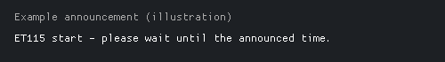
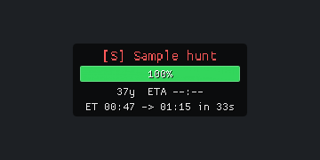

# AS Mob Plate

A lightweight, standalone Dalamud plugin for FFXIV A-rank and S-rank hunts. Display overhead HP plates, receive detection alerts, and track announced Eorzea Time starts without targeting a hunt.

[](docs/images/settings-en.png)

*English settings and live preview rendered from the implemented plugin UI on a plain background. All illustrations use sample data, with no game screenshots, characters, environments, or game UI assets.*

**Current release:** `1.0.016` | **Author:** [MintakaSeiran](https://github.com/MintakaSeiran)

## Nameplate Examples

| Idle | Countdown |
| --- | --- |
|  |  |
| HP and distance without an announced start. | Announced ET start and remaining real seconds. |

| In Progress | Arrival Warning |
| --- | --- |
|  |  |
| In-progress label and background. | Estimated arrival exceeds the remaining kill time. |

*Rendered English UI examples with sample data. The arrival warning's red/black background animation is shown as a still image.*

## Arrival Warning

For A/S hunts in combat at least 200 yalms away, the overlay estimates arrival from two-second samples of the player's movement projected toward the hunt. Arrival time is `(distance - arrival distance) / closing speed + preparation time`. Defaults are 25 yalms and 3 seconds. These are configurable estimates, not action-range checks or pathfinding.

When estimated arrival exceeds the HP-based remaining kill time, a 4-pixel (scaled) outer frame shows alternating red/yellow diagonal stripes, both at 50% opacity by default. The interior background smoothly pulses between near-black and dark red over a two-second cycle at 88% opacity to preserve text readability. Stripes never cover the content area. The warning overrides the normal and in-progress backgrounds, but preserves text, HP bars and countdown frames. Display settings can disable the warning; Appearance settings edit both frame stripe colors and alpha. Select "Likely too late" in Preview to inspect it.

Stopping, moving away, insufficient movement samples, teleports and missing kill estimates suppress the warning. Terrain, detours, changing speed and damage rate can make predictions inaccurate. This feature only reads game state and draws an overlay; it does not change targets, mounts or other plugins.

## Slash Commands

`/asmobplate`, `/amp`, `/asmob`, and `/asm` share all commands and toggle settings without arguments. Changes are saved immediately.

| Arguments | Action |
| --- | --- |
| `config` or `open` / `close` | Open / close settings |
| `preview` | Open settings and expand the preview |
| `help` / `status` | Print command help / current settings |
| `a`, `s` + `on`, `off`, or `toggle` | Enable or disable each hunt rank, including its detection alerts |
| `sound`, `tts`, `hp`, `percent`, `flag`, `countdown` + `on`, `off`, or `toggle` | Change the corresponding setting |
| `distance <1-2000>` | Set maximum plate display distance in yalms; notification distances are unchanged |
| `lang <en|jp|de|fr>` | Select the settings language |
| `log dump` / `log clear` | Save the debug log to the path printed in chat / clear the in-memory log |

Examples: `/amp a off`, `/amp sound toggle`, `/amp distance 2000`, `/amp lang jp`.
Commands and arguments are case-insensitive. Invalid arguments show help without changing settings. If another plugin owns an alias, AS Mob Plate leaves that command registered to its owner and records a warning.

## Features

- A/S-only nameplates with a translucent background, rank label, HP bar, HP percentage, and optional object index.
- Distance and estimated time to kill based on observed HP loss.
- Announced ET start times, remaining real seconds, and an in-progress state with a separate background color.
- A shrinking countdown outline with independently adjustable thickness.
- Configurable FFXIV sound repeats, Windows TTS, chat notices, and map flags on detection.
- Tabbed settings with EN, JP, DE, and FR translations and a live in-window preview.
- Standalone operation: no runtime dependency on HuntHelper.

## Companion Plugin: HuntAlerts

[HuntAlerts](https://puni.sh/directory/asuna/huntalerts) notifies you when hunt trains are starting soon. Using it alongside AS Mob Plate can make hunting more convenient: HuntAlerts helps you find upcoming trains, while AS Mob Plate shows local A/S hunt HP, distance, announced ET starts, and arrival estimates once a hunt is available in the game's object table.

- [HuntAlerts source repository](https://projects.gamba.pro/Asuna/huntalerts)
- [Asuna's plugin repository and installation information](https://puni.sh/directory/asuna)
- Custom Dalamud repository URL: `https://puni.sh/api/repository/asuna`

The plugins operate independently. AS Mob Plate does not require HuntAlerts, control its settings, or import its notification feed. ET countdowns still depend on supported chat announcements received by AS Mob Plate. If notifications overlap, adjust sound and TTS settings in each plugin to your preference.

## Settings and Preview

Open settings with:

```text
/asmobplate
```

The window has **Display**, **Alerts**, **Start time**, **Appearance**, **Log**, and **Info** tabs. The language selector stays above the tabs, and changes are saved immediately. The initial UI language is JP; select EN for English. Existing settings are preserved.

The collapsible preview uses the same `NameplatePainter` as the live overlay. Switch between A/S ranks, adjust sample HP from 0 to 100%, and inspect idle, countdown, or in-progress states. Appearance changes are reflected on the next frame. Countdown animation repeats the configured countdown followed by three seconds in progress.

Preview plates retain their configured scale and scroll when larger than the available area. Sample data includes a distance of 23 yalms, object index 118, and a 75-second ETA below full HP. Zero HP is available only for appearance testing; dead hunts are excluded from the live overlay.

Preview controls are temporary and do not change live hunt data or ET schedules. They do not trigger sounds, TTS, chat notices, map flags, or game countdown commands. World positioning, Y offset, and actual detection ranges must be checked in game.

Translations cover settings, units, tabs, fixed plate text, countdown text, and chat detection notices. Hunt names follow the game's language. Custom TTS text and technical diagnostic logs are not translated. Translation strings are maintained in `Localization/UiText.cs`.

## Detection and Distances

`Hunts/HuntMarkRegistry.cs` contains explicit A/S `NameId` allow-lists covering A Realm Reborn through Dawntrail. Each frame, the renderer scans `IObjectTable` for `IBattleNpc` entries and checks `IBattleNpc.NameId`. It never guesses hunt rank from names, levels, HP totals, icons, or a rank field.

Normal enemies, B ranks, FATE mobs, other NPCs, and players are excluded. Entries with zero maximum HP or zero current HP are skipped. Plates disappear when objects leave the object table and do not require targeting or combat.

| Setting | Default | Maximum |
| --- | --- | --- |
| Max display distance | 2000 yalms | 2000 yalms |
| A rank notification distance | 200 yalms | 1000 yalms |
| S rank notification distance | 1000 yalms | 2000 yalms |

Display distance controls overhead rendering. Notification distances control detection alerts and map flags independently. A distant S rank can be detected only if the game exposes it in the object table; this plugin cannot reveal unloaded objects or guarantee map-wide detection.

## Nameplate Appearance

The live overlay is drawn from `UiBuilder.Draw` with `ImGui.GetForegroundDrawList()`. `IGameGui.WorldToScreen()` projects an anchor based on the hunt's position and hitbox radius, with an adjustable Y offset. The overlay does not capture clicks.

The HP bar remains visible at 100% HP when enabled. Appearance settings control name size, bar dimensions, scale, text colors, HP color, normal and in-progress backgrounds, and the countdown frame.

`Countdown frame thickness` adjusts only the outline from 1 to 10 pixels, with a default of 2 pixels at scale 1.0. Overall scale also scales the stroke, with a one-pixel rendering minimum. The stroke expands outward to avoid covering plate content. During the countdown window, the outline progressively shrinks around the plate from the top-right corner.

`Overlay/HpTracker.cs` estimates time to kill as `CurrentHp / observedHpLossPerSecond`. A new sample, no HP loss, or an HP increase produces `--:--` instead of a prediction. This is an estimate, not a guaranteed defeat time.

## Detection Alerts

When a hunt enters its notification range, enabled actions can play an FFXIV chat sound, speak a configurable TTS message, print a chat notice, or open the map with a flag at the hunt's position. Sound repeats default to four. TTS templates support `{rank}` and `{name}`.

An object is notified once while it remains in range. Leaving range or disappearing allows a later notification, subject to the notification cooldown. Windows TTS availability depends on installed speech support.

## Announced Start Times

The chat tracker recognizes announcements such as `ET 22:30`, `ET830`, `ET 830`, `22:30 start`, and `pull 22:30`. The game's special ET glyph and Japanese start keywords are also supported. Plain numbers without a recognized marker are not treated as announcements.

### Chat Detection Example



The example announcement above contains `ET115`, which is interpreted as **ET 01:15**. Japanese text immediately after the time is also supported.



The illustrated plate shows the ET captured when the announcement was accepted (`00:47`), the announced start (`01:15`), and the remaining real seconds (`33` in this example). The receipt ET stays fixed while the remaining time updates. Consequently, subtracting the two displayed ET values gives the original wait, not the current remaining wait. One ET minute equals approximately 2.917 real seconds.

*The announcement is an illustrative text panel, not the game's chat UI. The nameplate uses the plugin's actual renderer with a fictional hunt name.*

### Supported Text Variations

| Input | Interpreted ET |
| --- | --- |
| `ET115`, `ET0115` | 01:15 |
| `ET1:15`, `et 01:15` | 01:15 |
| Full-width `ＥＴ１：１５` | 01:15 |
| Mixed-width `ET１０：４０` | 10:40 |
| In-game ET glyph (U+E0D2) followed by `830` | 08:30 |
| `1:15 start`, `pull 1:15` | 01:15 |

Full-width Latin letters, digits and colons are normalized before matching. ET letters are case-insensitive, and whitespace is allowed around the colon and after the ET marker. Colonless times require an ET marker or the game's ET glyph. Colon-form times require a recognized keyword somewhere in the message, such as ET, start, pull, or a supported Japanese start keyword.

This is pattern matching, not natural-language understanding: arbitrary typos and all possible wording variations are not supported. Announcements are also checked against the configured ET window. The tracker does not match a hunt name in the message; the accepted schedule is shared by displayed A/S hunts in the current territory.

Example plate text:

```text
ET 13:13 -> 13:19  in 18s
```

### Clock and Conversion

- The time source is `Framework.Instance()->ClientTime.EorzeaTime`, read directly from the game. PC time and chat timestamps are diagnostic only.
- Announcement receipt ET retains seconds even though the plate displays hours and minutes.
- Remaining real seconds are `(targetEtSeconds - currentEtSeconds) * 7 / 144`. One ET minute is `35 / 12`, approximately 2.916667 real seconds; one ET hour is 175 real seconds.
- `ET1319` means `13:19:00`. Receipt at `13:13:00` leaves 17.5 real seconds; receipt at `13:13:30` leaves approximately 16.042 seconds. Displayed whole seconds round upward.
- The nearest occurrence across midnight is selected. The default announcement window is plus or minus 120 ET minutes; announcements outside it are logged and ignored instead of creating a next-day wait.
- Once the target passes, the plate switches to the in-progress label and background. `Start time display after pull` controls how long it remains visible.
- Repeated announcements for the same target retain the original receipt ET and countdown state. A different valid target replaces the schedule.
- Time is refreshed on `IFramework.Update`, independently of drawing or camera visibility. Logout, territory changes, unavailable game time, or a game clock override clear the schedule. There is no PC-clock fallback.
- Chat normally captures ET immediately on the game thread. Off-thread messages are deferred to the next game update and logged with `deferred=True`.

### Native Game Countdown

The default countdown is 10 real seconds, configurable from 5 to 30. This duration controls both the automatic `/countdown N` trigger and the shrinking outline.

If an announcement arrives with enough time remaining, the plugin attempts the command once when the remaining time crosses the selected duration. Late announcements are displayed but do not start an automatic countdown. A trigger missed by more than 0.5 seconds, for example during a frame stall, is skipped. Rejected commands are not retried every frame.

The plugin submits a fixed-format command through `UIModule.ProcessChatBoxEntry`; it never executes received chat text as a command. Party and other game-side restrictions still apply. A `countdown submitted` log entry confirms submission, not acceptance by the game. Frame timing and game command processing can introduce latency.

### Configuration Migration

Configuration schema version 9 removes the former clock correction, configurable real-seconds-per-ET-minute, and separate countdown lead-time settings. Existing unrelated settings are preserved. `ET announcement window` retains the legacy `EtStartPastToleranceMinutes` storage key but now applies in both directions.

## Diagnostics

The **Log** tab provides **Copy log**, **Save log**, and **Clear log**. Saving writes `debug-log.txt` to the following dev-plugin location:

```text
%APPDATA%\XIVLauncher\devPlugins\AsMobPlate\debug-log.txt
```

The live `Game ET` display includes seconds and works without a hunt in view. The 160-line ring buffer records clock source, receipt and target ET, ET differences, remaining real seconds, ignored announcements, countdown submission or skip events, and periodic clock samples. Local timestamps are diagnostic only. Review logs for chat content before sharing them.

To verify timing in game:

1. Reload the dev plugin and open `/asmobplate`.
2. Compare `Game ET` in the Log tab with the game's ET clock.
3. Use an announcement approximately six ET minutes ahead, such as `/echo ET1319` near ET 13:13.
4. Check `receivedET` and `remainingRealSeconds`, including the received seconds.
5. In an eligible party, verify the native countdown and save the log if troubleshooting is needed.

## Build and Tests

Build on Windows with the .NET 10 SDK and local Dalamud development libraries:

```powershell
dotnet run --project tests/AsMobPlate.Timing.Tests/AsMobPlate.Timing.Tests.csproj
dotnet run --project tests/AsMobPlate.Rendering.Tests/AsMobPlate.Rendering.Tests.csproj
dotnet build -c Debug
```

Timing tests cover clock conversion, midnight rollover, duplicate announcements, and countdown scheduling. Rendering tests exercise actual ImGui geometry with four languages, HP states, scales, and window sizes. They do not verify game fonts or GPU-rendered appearance.

The rendering harness defaults to `%APPDATA%\XIVLauncher\addon\Hooks\dev`; use `-p:DalamudLibPath=...` for another location.

For local dev-plugin loading, select the built `AsMobPlate.dll` in Dalamud's developer plugin settings and keep its generated manifest and dependencies alongside it. The plugin installer uses `images/icon.png` and `images/image1.png`; these are copied beside the DLL under `images/`. README illustrations are stored in `docs/images/`. All current images are generated without game assets. Recreate them on Windows with `dotnet run --project tests/AsMobPlate.Rendering.Tests -- --export .` from the repository root. The exporter draws the implemented ImGui UI and rasterizes its geometry with the bundled default ImGui font.

## Versioning and References

`AsMobPlate.csproj` is the authoritative release version. Delivered revisions increment the zero-padded patch number once. .NET and Dalamud may normalize `1.0.016` to `1.0.16.0`. `Configuration.Version` is an independent migration number.

API references: [ClientTime](https://github.com/aers/FFXIVClientStructs/blob/main/FFXIVClientStructs/FFXIV/Client/System/Timer/ClientTime.cs), [UIModule](https://github.com/aers/FFXIVClientStructs/blob/main/FFXIVClientStructs/FFXIV/Client/UI/UIModule.cs), and [Dalamud CommandManager](https://github.com/goatcorp/Dalamud/blob/master/Dalamud/Game/Command/CommandManager.cs).
